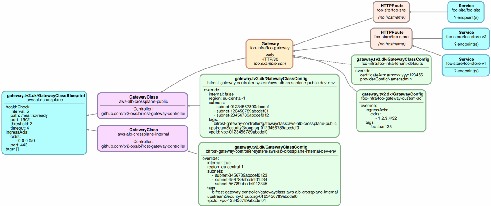

# Gateway API Lens

**Gateway API Lens** is a tool to visualize [Kubernetes Gateway
API](https://gateway-api.sigs.k8s.i) configuration.

The following example from
[gateway-API](https://gateway-api.sigs.k8s.io) will be used to
illustrate the different outputs formats generated:


Additionally, Gateway Blueprint and attached policies from the
[Bifrost Gateway
Controller](https://github.com/tv2-oss/bifrost-gateway-controller)
will be used.

See [Makefile.local](Makefile.local) for how to setup the example
usecase.

# Graphviz Graph Output

To output the Gateway-API configuration on Graphviz dot format, with
the path `spec.values` from the `GatewayClass` parameter resource also
shown:

```bash
$ gateway-api-lens -o graph --gwc-param-path spec.values  |  dot -Tsvg > output.svg
```

In the example, policies (see
[GEP-713](https://gateway-api.sigs.k8s.io/geps/gep-713)) are attached
to both `GatewayClass` and `Gateway` resources as well as the
namespace of the `Gateway` (such indirect attachments are shown with a
dashed arrow):



It is also possible to run the tool in a web-server mode, where the
graph will available through HTTP on the specified port:

```bash
$ gateway-api-lens -o graph -l 8080
```

The container-based version can be executed with:

```bash
docker run --rm -u $(id -u) -p 8080 -v $HOME/.kube:/kube:ro --network host ghcr.io/michaelvl/gateway-api-lens:latest -l 8080 --kubeconfig /kube/config
```

The argument `--network host` is only needed with a local cluster like
KIND. Also note, that the container image only have the
gateway-api-lens executable and does not work if your kubeconfig
require additional auth binaries.

# Policies in Table Format

```bash
$ gateway-api-lens -o policy

NAMESPACE                         POLICY                                                 TARGET                                   DEFAULT OVERRIDE
bifrost-gateway-controller-system GatewayClassConfig/aws-alb-crossplane-internal-dev-env GatewayClass/aws-alb-crossplane-internal No      Yes
bifrost-gateway-controller-system GatewayClassConfig/aws-alb-crossplane-public-dev-env   GatewayClass/aws-alb-crossplane-public   No      Yes
foo-infra                         GatewayClassConfig/foo-infra-tenant-defaults           Namespace/foo-infra                      No      Yes
foo-infra                         GatewayConfig/foo-gateway-custom-acl                   Gateway/foo-infra/foo-gateway            No      Yes
```

# Hierarchy Format

```bash
$ gateway-api-lens -o hierarchy

RESOURCE                                 CONFIGURATION
GatewayClass aws-alb-crossplane-internal
GatewayClass aws-alb-crossplane-public
 └─ Gateway foo-infra/foo-gateway        web:HTTP/80 foo.example.com
     ├─ HTTPRoute foo-site/foo-site
     │   ├─ match                        PathPrefix /site
     │   └─ backends                     Service/foo-site/foo-site:80@1
     └─ HTTPRoute foo-store/foo-store
         ├─ match                        PathPrefix /store
         └─ backends                     Service/foo-store-v1:80@90 Service/foo-store-v2:80@10
```

# Route-tree Format

```bash
$ gateway-api-lens -o route-tree

HOSTNAME/MATCH         BACKEND
foo.example.com
  ├─ PathPrefix /site  Service/foo-site/foo-site:80@1
  └─ PathPrefix /store Service/foo-store-v1:80@90 Service/foo-store-v2:80@10
```
